# Testnet Verification architecture

```mermaid
flowchart LR
    M[Closed public market facts] --> P[Adaptive TradingPool]
    P --> F[Features / active factors]
    F --> K[StrategyKernel.evaluate]
    K --> T[PortfolioTarget / proposal hash]
    T --> S[Canonical AdaptiveSizing]
    S --> L[Binance leverage set + readback]
    L --> D[DecisionTrace PREPARED]
    D --> A[BinanceUsdmAdapter only writer]
    A --> R[REST HMAC transport]
    R --> Q[ACK or UNKNOWN query by same client id]
    Q --> X[Fill / position readback]
    X --> C[Reconciliation + fee/funding/slippage/PnL facts]
    C --> E[Redacted evidence manifest]
    G[TestnetEnvironmentGuard\nHTTPS + host allowlist + caps + kill switch] -. gates .-> A
    D -. durable identity .-> Q
    Z[Legacy Safety / G5 / Production / Mainnet] -. excluded .-> K
```

The verifier has one composition root, `apps.testnet_verify`. Binance HMAC is
retained inside the exchange transport. Internal production signing,
certification, HA, and Mainnet paths remain frozen and outside this graph.
