# 目标架构

```mermaid
flowchart LR
  M[Raw market events] --> B[ClosedBar + PIT manifest]
  B --> R[Factor mining / OOS / cost-capacity]
  R --> G[Promotion Gate]
  G --> K[Single StrategyKernel]
  K --> A[ApprovalEnvelope]
  A --> I[Durable Intent + Outbox]
  I --> F[Fenced Executor]
  F --> V[Exchange Adapter]
  V --> E[ACK / user-stream / REST gap-fill]
  E --> O[OrderAggregate + FillStore]
  O --> P[PositionProjection + Ledger]
  P --> X[Protection semantic verifier]
  X --> C[Three-way reconciliation]
  C --> H[Authority / health / evidence]
```

唯一允许的风险增加边界是 `ApprovalEnvelope → durable Intent → fenced Executor → Adapter`；所有其它路径只能读取、诊断或减风险。任何证据中断都回到 `NO_NEW_RISK/CLOSE_ONLY`，恢复顺序为 `RECOVERY → fresh three-way reconciliation → named authorization → NORMAL`。

