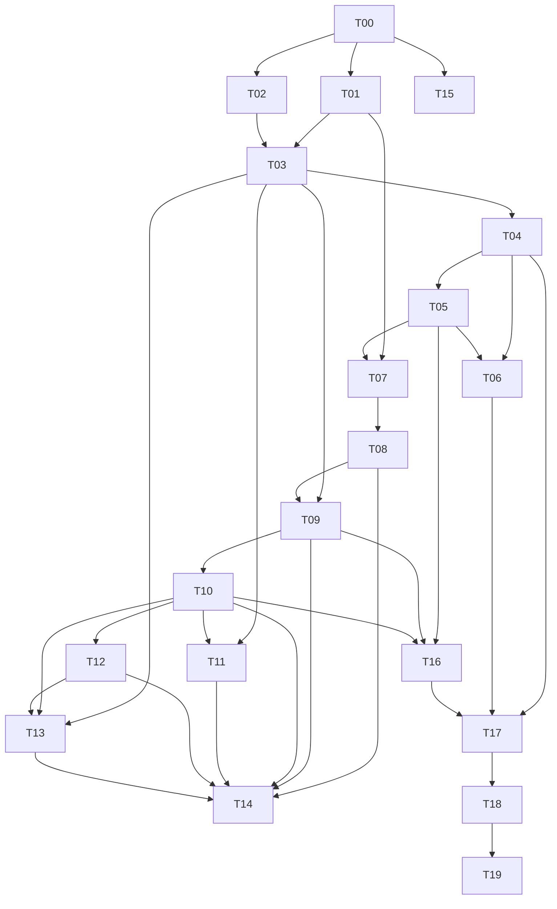

# 任务依赖图

```mermaid
graph TD
  T00 --> T01
  T00 --> T02
  T00 --> T15
  T01 --> T03
  T02 --> T03
  T03 --> T04
  T04 --> T05
  T04 --> T06
  T05 --> T06
  T01 --> T07
  T05 --> T07
  T07 --> T08
  T03 --> T09
  T08 --> T09
  T09 --> T10
  T03 --> T11
  T10 --> T11
  T10 --> T12
  T03 --> T13
  T10 --> T13
  T12 --> T13
  T08 --> T14
  T09 --> T14
  T10 --> T14
  T11 --> T14
  T12 --> T14
  T13 --> T14
  T05 --> T16
  T09 --> T16
  T10 --> T16
  T04 --> T17
  T06 --> T17
  T16 --> T17
  T17 --> T18
  T18 --> T19
```

`T15` 是贯穿门禁，每个任务合并前都必须通过其适用检查。
